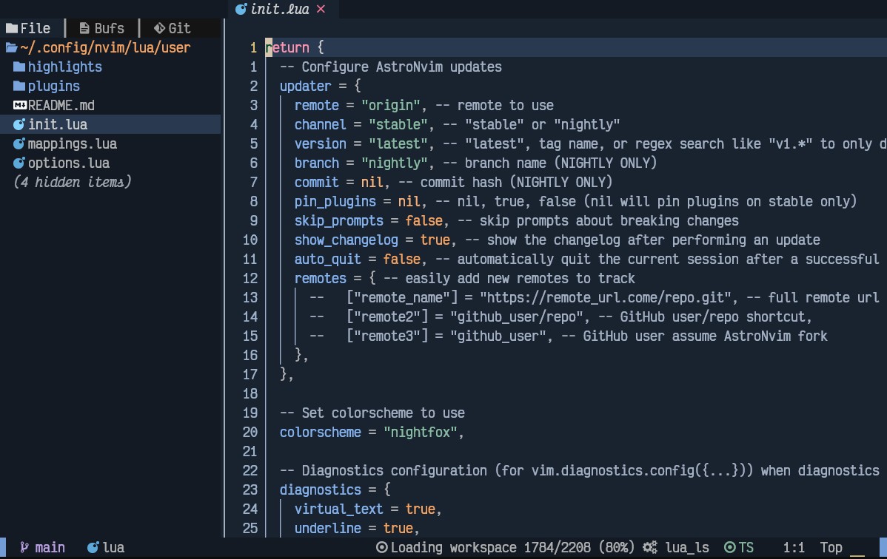

# Minha configuração de usuário para AstroNvim

Baseado no template [AstroNvim](https://github.com/AstroNvim/AstroNvim)



## 🛠️ Instalação

### Faça o backup de sua configuração nvim atual se quiser

```shell
# sh
mv ~/.config/nvim ~/.config/nvim.bak
mv ~/.local/share/nvim ~/.local/share/nvim.bak
```
```powershell
# pwsh
rni -Path $env:LOCALAPPDATA\nvim -NewName $env:LOCALAPPDATA\nvim.bak
rni -Path $env:LOCALAPPDATA\nvim-data -NewName $env:LOCALAPPDATA\nvim-data.bak
```
### Instale a configuração do AstroNvim

```shell
# sh
git clone https://github.com/AstroNvim/AstroNvim ~/.config/nvim
```
```powershell
# pwsh
git clone https://github.com/AstroNvim/AstroNvim $env:LOCALAPPDATA\nvim
```

> Veja mais instruções em https://github.com/AstroNvim/AstroNvim para pré-requisitos e setup inicial

### Clone este repositório de configurações do usuário

```shell
# sh
git clone https://github.com/erlimar/astronvim_config ~/.config/nvim/lua/user
```
```powershell
# pwsh
git clone https://github.com/erlimar/astronvim_config $env:LOCALAPPDATA\nvim\lua\user
```

### Inicie seu Neovim

```shell
nvim
```
